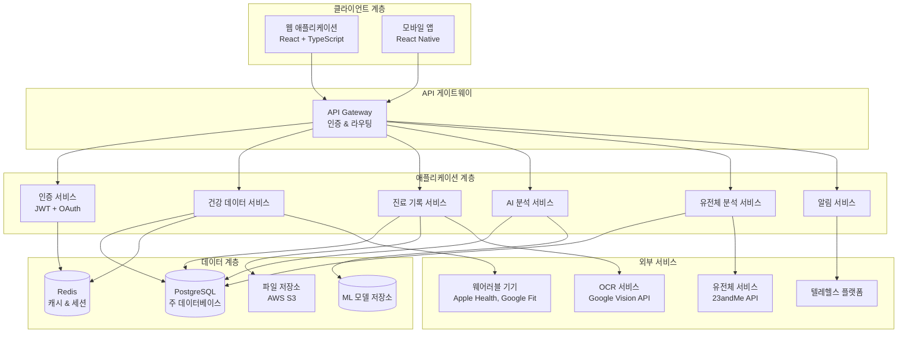
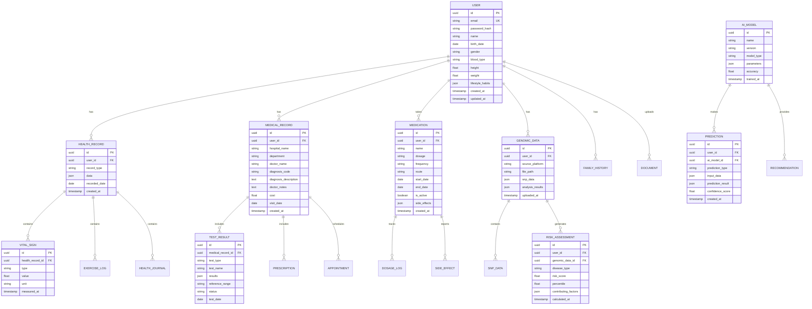

# 개인 건강 플랫폼 설계 문서

## 개요

개인 건강 플랫폼은 사용자의 건강 데이터를 체계적으로 수집, 저장, 분석하여 맞춤형 건강 관리 및 질병 예측 서비스를 제공하는 통합 웹 애플리케이션입니다. React + TypeScript 프론트엔드와 Node.js + Express 백엔드, PostgreSQL 데이터베이스를 기반으로 구축되며, AI/ML 기능과 유전체 분석을 포함한 고급 건강 분석 기능을 제공합니다.

## 아키텍처

### 전체 시스템 아키텍처



### 마이크로서비스 아키텍처

시스템은 다음과 같은 주요 서비스로 구성됩니다:

1. **사용자 관리 서비스**: 인증, 권한, 프로필 관리
2. **건강 데이터 서비스**: 바이탈 사인, 건강 일지, 운동 기록
3. **진료 기록 서비스**: 병원 방문, 처방전, 검사 결과
4. **약물 관리 서비스**: 복약 일정, 상호작용 경고
5. **AI 분석 서비스**: 머신러닝 예측, 건강 인사이트
6. **유전체 분석 서비스**: 유전자 데이터 처리, 위험도 계산
7. **문서 관리 서비스**: OCR, 파일 업로드, 분류
8. **알림 서비스**: 복약 알림, 예약 알림, 건강 경고

## 컴포넌트 및 인터페이스

### 프론트엔드 컴포넌트 구조

```
src/
├── components/
│   ├── common/
│   │   ├── Header.tsx
│   │   ├── Sidebar.tsx
│   │   ├── LoadingSpinner.tsx
│   │   └── ErrorBoundary.tsx
│   ├── dashboard/
│   │   ├── DashboardOverview.tsx
│   │   ├── HealthMetricsCards.tsx
│   │   ├── TrendCharts.tsx
│   │   └── TodoChecklist.tsx
│   ├── health/
│   │   ├── VitalSignsForm.tsx
│   │   ├── HealthJournal.tsx
│   │   ├── ExerciseTracker.tsx
│   │   └── WeightChart.tsx
│   ├── medical/
│   │   ├── MedicalRecordsList.tsx
│   │   ├── TestResultsViewer.tsx
│   │   ├── PrescriptionManager.tsx
│   │   └── AppointmentScheduler.tsx
│   ├── medication/
│   │   ├── MedicationSchedule.tsx
│   │   ├── DosageTracker.tsx
│   │   └── InteractionWarnings.tsx
│   ├── genomics/
│   │   ├── GenomicDataUpload.tsx
│   │   ├── RiskAssessment.tsx
│   │   └── FamilyTreeVisualization.tsx
│   └── ai/
│       ├── HealthInsights.tsx
│       ├── PredictionDashboard.tsx
│       └── ChatbotInterface.tsx
├── services/
│   ├── api.ts
│   ├── auth.ts
│   ├── healthData.ts
│   ├── medicalRecords.ts
│   └── genomics.ts
├── hooks/
│   ├── useAuth.ts
│   ├── useHealthData.ts
│   └── useNotifications.ts
├── types/
│   ├── user.ts
│   ├── health.ts
│   ├── medical.ts
│   └── genomics.ts
└── utils/
    ├── dateHelpers.ts
    ├── chartHelpers.ts
    └── validation.ts
```

### 백엔드 API 구조

```
src/
├── controllers/
│   ├── authController.ts
│   ├── healthController.ts
│   ├── medicalController.ts
│   ├── medicationController.ts
│   ├── genomicsController.ts
│   └── aiController.ts
├── services/
│   ├── authService.ts
│   ├── healthService.ts
│   ├── medicalService.ts
│   ├── medicationService.ts
│   ├── genomicsService.ts
│   ├── aiService.ts
│   └── notificationService.ts
├── models/
│   ├── User.ts
│   ├── HealthRecord.ts
│   ├── MedicalRecord.ts
│   ├── Medication.ts
│   ├── GenomicData.ts
│   └── AIModel.ts
├── middleware/
│   ├── auth.ts
│   ├── validation.ts
│   ├── errorHandler.ts
│   └── rateLimiter.ts
├── routes/
│   ├── auth.ts
│   ├── health.ts
│   ├── medical.ts
│   ├── medication.ts
│   ├── genomics.ts
│   └── ai.ts
└── utils/
    ├── encryption.ts
    ├── mlHelpers.ts
    └── genomicAnalysis.ts
```

## 데이터 모델

### 핵심 엔티티 관계도



### 주요 데이터 타입

```typescript
// 사용자 프로필
interface UserProfile {
  id: string;
  email: string;
  name: string;
  birthDate: Date;
  gender: 'male' | 'female' | 'other';
  bloodType: string;
  height: number;
  weight: number;
  lifestyleHabits: {
    smoking: boolean;
    alcohol: 'none' | 'light' | 'moderate' | 'heavy';
    exerciseFrequency: number;
    dietType: string;
  };
}

// 바이탈 사인
interface VitalSign {
  id: string;
  type: 'blood_pressure' | 'heart_rate' | 'temperature' | 'blood_sugar' | 'weight';
  value: number | { systolic: number; diastolic: number };
  unit: string;
  measuredAt: Date;
}

// 진료 기록
interface MedicalRecord {
  id: string;
  hospitalName: string;
  department: string;
  doctorName: string;
  diagnosisCode: string;
  diagnosisDescription: string;
  doctorNotes: string;
  cost: number;
  visitDate: Date;
  testResults: TestResult[];
  prescriptions: Prescription[];
}

// 유전체 데이터
interface GenomicData {
  id: string;
  sourcePlatform: '23andme' | 'ancestry' | 'other';
  snpData: Record<string, string>;
  analysisResults: {
    pharmacogenomics: Record<string, any>;
    diseaseRisks: RiskAssessment[];
    traits: Record<string, any>;
  };
}

// 위험도 평가
interface RiskAssessment {
  diseaseType: string;
  riskScore: number;
  percentile: number;
  contributingFactors: {
    genetic: number;
    lifestyle: number;
    familyHistory: number;
  };
}
```

## 에러 처리

### 에러 분류 및 처리 전략

1. **클라이언트 에러 (4xx)**
   - 400 Bad Request: 잘못된 요청 데이터
   - 401 Unauthorized: 인증 실패
   - 403 Forbidden: 권한 부족
   - 404 Not Found: 리소스 없음
   - 422 Unprocessable Entity: 유효성 검사 실패

2. **서버 에러 (5xx)**
   - 500 Internal Server Error: 일반적인 서버 오류
   - 502 Bad Gateway: 외부 서비스 연결 실패
   - 503 Service Unavailable: 서비스 일시 중단

3. **비즈니스 로직 에러**
   - 의료 데이터 유효성 검사 실패
   - 약물 상호작용 경고
   - 유전체 데이터 분석 실패
   - AI 모델 예측 실패

### 에러 처리 구현

```typescript
// 커스텀 에러 클래스
class HealthPlatformError extends Error {
  constructor(
    public code: string,
    public message: string,
    public statusCode: number,
    public details?: any
  ) {
    super(message);
    this.name = 'HealthPlatformError';
  }
}

// 에러 핸들러 미들웨어
const errorHandler = (err: Error, req: Request, res: Response, next: NextFunction) => {
  if (err instanceof HealthPlatformError) {
    return res.status(err.statusCode).json({
      error: {
        code: err.code,
        message: err.message,
        details: err.details
      }
    });
  }
  
  // 예상치 못한 에러
  console.error('Unexpected error:', err);
  return res.status(500).json({
    error: {
      code: 'INTERNAL_ERROR',
      message: '서버 내부 오류가 발생했습니다.'
    }
  });
};
```

## 테스팅 전략

### 테스트 피라미드

1. **단위 테스트 (70%)**
   - 개별 함수 및 컴포넌트 테스트
   - Jest + React Testing Library
   - 비즈니스 로직 검증

2. **통합 테스트 (20%)**
   - API 엔드포인트 테스트
   - 데이터베이스 연동 테스트
   - 외부 서비스 모킹

3. **E2E 테스트 (10%)**
   - 사용자 시나리오 테스트
   - Cypress 또는 Playwright
   - 핵심 워크플로우 검증

### 테스트 환경 구성

```typescript
// 테스트 데이터베이스 설정
const testDbConfig = {
  host: 'localhost',
  port: 5433,
  database: 'health_platform_test',
  username: 'test_user',
  password: 'test_password'
};

// 모킹 설정
jest.mock('../services/genomicService', () => ({
  analyzeGenomicData: jest.fn(),
  calculateRiskScore: jest.fn()
}));

// 테스트 유틸리티
const createTestUser = async (): Promise<User> => {
  return await User.create({
    email: 'test@example.com',
    name: 'Test User',
    birthDate: new Date('1990-01-01'),
    gender: 'male'
  });
};
```

### 보안 테스트

1. **인증 및 권한 테스트**
   - JWT 토큰 검증
   - 권한 기반 접근 제어
   - 세션 관리

2. **데이터 보안 테스트**
   - 민감한 데이터 암호화
   - SQL 인젝션 방지
   - XSS 공격 방지

3. **API 보안 테스트**
   - Rate limiting
   - CORS 설정
   - 입력 데이터 검증

이 설계 문서는 개인 건강 플랫폼의 전체적인 아키텍처와 구현 방향을 제시합니다. 각 컴포넌트는 확장 가능하고 유지보수가 용이하도록 설계되었으며, 보안과 성능을 고려한 최적화된 구조를 제공합니다.