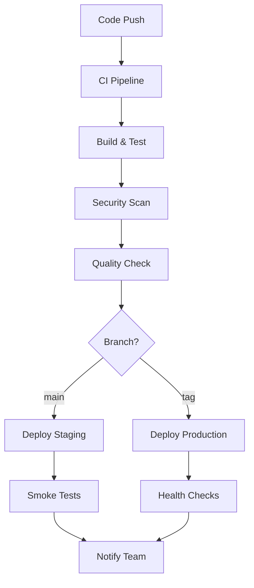

# CI/CD Pipeline Documentation

This document describes the Continuous Integration and Continuous Deployment pipeline for the Personal Health Platform.

## Overview

The CI/CD pipeline is built using GitHub Actions and implements a comprehensive workflow that includes:

- **Continuous Integration (CI)**: Automated testing, security scanning, and quality checks
- **Continuous Deployment (CD)**: Automated deployment to staging and production environments
- **Security Scanning**: Regular vulnerability assessments and compliance checks
- **Performance Testing**: Load testing and performance monitoring

## Pipeline Architecture



## Workflows

### 1. Continuous Integration (`ci.yml`)

**Triggers:**
- Push to `main` or `develop` branches
- Pull requests to `main` or `develop`

**Jobs:**
- **Frontend Tests**: Linting, building, and testing React application
- **Backend Tests**: API testing with PostgreSQL and Redis services
- **Security Scan**: Trivy vulnerability scanning
- **Docker Build**: Test Docker image builds
- **Integration Tests**: End-to-end testing with Docker Compose
- **Code Quality**: SonarCloud analysis
- **Dependency Check**: NPM audit for vulnerabilities
- **Performance Tests**: K6 load testing (main branch only)

**Environment Variables:**
```yaml
NODE_VERSION: '18'
POSTGRES_VERSION: '15'
REDIS_VERSION: '7'
```

### 2. Continuous Deployment (`cd.yml`)

**Triggers:**
- Push to `main` branch (staging deployment)
- Tagged releases (production deployment)
- Manual workflow dispatch

**Jobs:**
- **Build and Push**: Build Docker images and push to registry
- **Deploy Staging**: Automated staging deployment
- **Deploy Production**: Blue-green production deployment
- **Rollback**: Automatic rollback on failure
- **Post-deployment**: Monitoring updates and cache warming

**Deployment Strategy:**
- **Staging**: Direct deployment with health checks
- **Production**: Blue-green deployment with zero downtime

### 3. Security Scanning (`security.yml`)

**Triggers:**
- Daily schedule (2 AM UTC)
- Push to main/develop branches
- Pull requests to main

**Jobs:**
- **Dependency Scan**: NPM audit for vulnerabilities
- **Container Scan**: Trivy security scanning of Docker images
- **Code Security**: CodeQL static analysis
- **Secret Scan**: TruffleHog secret detection
- **License Check**: License compliance verification
- **OWASP ZAP**: Dynamic security testing

### 4. Performance Testing (`performance.yml`)

**Triggers:**
- Weekly schedule (Monday 4 AM UTC)
- Push to main branch
- Manual workflow dispatch

**Jobs:**
- **Load Testing**: K6 performance testing
- **Stress Testing**: High-load scenario testing
- **Database Performance**: Database query optimization testing
- **Frontend Performance**: Lighthouse performance auditing

## Environment Configuration

### Development Environment

```yaml
# .env.development
NODE_ENV=development
POSTGRES_DB=health_platform_dev
POSTGRES_USER=postgres
POSTGRES_PASSWORD=password
JWT_SECRET=dev-jwt-secret-key
```

### Staging Environment

```yaml
# .env.staging
NODE_ENV=staging
POSTGRES_DB=health_platform_staging
POSTGRES_USER=staging_user
POSTGRES_PASSWORD=${STAGING_DB_PASSWORD}
JWT_SECRET=${STAGING_JWT_SECRET}
```

### Production Environment

```yaml
# .env.production
NODE_ENV=production
POSTGRES_DB=${POSTGRES_DB}
POSTGRES_USER=${POSTGRES_USER}
POSTGRES_PASSWORD=${POSTGRES_PASSWORD}
JWT_SECRET=${JWT_SECRET}
```

## Secrets Management

### Required GitHub Secrets

#### Staging Deployment
- `STAGING_HOST`: Staging server hostname
- `STAGING_USER`: SSH username for staging
- `STAGING_SSH_KEY`: SSH private key for staging
- `STAGING_PORT`: SSH port (default: 22)
- `STAGING_URL`: Full staging URL for testing

#### Production Deployment
- `PRODUCTION_HOST`: Production server hostname
- `PRODUCTION_USER`: SSH username for production
- `PRODUCTION_SSH_KEY`: SSH private key for production
- `PRODUCTION_PORT`: SSH port (default: 22)
- `PRODUCTION_URL`: Full production URL for testing

#### External Services
- `DOCKER_REGISTRY`: Docker registry URL (optional)
- `SONAR_TOKEN`: SonarCloud authentication token
- `SLACK_WEBHOOK`: Slack webhook URL for notifications

#### Database and Services
- `POSTGRES_PASSWORD`: Production database password
- `REDIS_PASSWORD`: Production Redis password
- `JWT_SECRET`: Production JWT signing secret

## Deployment Process

### Staging Deployment

1. **Automatic Trigger**: Push to `main` branch
2. **Build Process**: 
   - Build Docker images
   - Push to container registry
3. **Deployment**:
   - SSH to staging server
   - Pull latest code and images
   - Update Docker Compose services
   - Run database migrations
4. **Verification**:
   - Health checks
   - Smoke tests
   - Notification to team

### Production Deployment

1. **Manual Trigger**: Create and push git tag
   ```bash
   git tag -a v1.0.0 -m "Release v1.0.0"
   git push origin v1.0.0
   ```

2. **Blue-Green Strategy**:
   - Create backup of current system
   - Deploy new version to "green" environment
   - Run comprehensive health checks
   - Switch traffic to green environment
   - Terminate old "blue" environment

3. **Rollback Process**:
   - Automatic rollback on health check failure
   - Manual rollback capability
   - Database restoration from backup

## Quality Gates

### Code Quality Requirements

- **Test Coverage**: Minimum 80% code coverage
- **Security**: No high-severity vulnerabilities
- **Performance**: 95th percentile response time < 500ms
- **Accessibility**: Lighthouse accessibility score > 90%

### Deployment Gates

- **Staging**: All CI checks must pass
- **Production**: 
  - Successful staging deployment
  - Tagged release required
  - Manual approval for production environment

## Monitoring and Alerting

### Health Checks

All deployments include comprehensive health checks:

```bash
# Frontend health
curl -f https://app.domain.com/health

# Backend API health
curl -f https://api.domain.com/health

# Database connectivity
curl -f https://api.domain.com/health/database

# Redis connectivity
curl -f https://api.domain.com/health/redis
```

### Performance Monitoring

- **Response Time**: API endpoint response times
- **Error Rate**: Application error rates
- **Resource Usage**: CPU, memory, and disk usage
- **Database Performance**: Query execution times

### Alerting Rules

- **High Error Rate**: > 5% error rate for 5 minutes
- **Slow Response**: > 1s average response time for 10 minutes
- **Resource Usage**: > 80% CPU/memory usage for 15 minutes
- **Failed Deployment**: Immediate notification on deployment failure

## Troubleshooting

### Common Issues

1. **Build Failures**:
   ```bash
   # Check build logs
   gh run view --log
   
   # Retry failed jobs
   gh run rerun --failed
   ```

2. **Deployment Failures**:
   ```bash
   # Check deployment logs
   ssh user@server 'docker-compose logs'
   
   # Manual rollback
   ./scripts/deploy-production.sh rollback
   ```

3. **Test Failures**:
   ```bash
   # Run tests locally
   npm test
   
   # Check test coverage
   npm run test:coverage
   ```

### Debug Mode

Enable debug logging in workflows:

```yaml
env:
  ACTIONS_STEP_DEBUG: true
  ACTIONS_RUNNER_DEBUG: true
```

## Security Considerations

### Container Security

- **Base Images**: Use official, minimal base images
- **User Privileges**: Run containers as non-root user
- **Secrets**: Never include secrets in images
- **Scanning**: Regular vulnerability scanning

### Access Control

- **SSH Keys**: Rotate SSH keys regularly
- **Secrets**: Use GitHub Secrets for sensitive data
- **Permissions**: Minimal required permissions
- **Audit**: Regular access reviews

### Network Security

- **TLS**: All communications over HTTPS/TLS
- **Firewall**: Restrict network access
- **VPN**: Use VPN for server access
- **Monitoring**: Network traffic monitoring

## Performance Optimization

### Build Optimization

- **Docker Layer Caching**: Use GitHub Actions cache
- **Multi-stage Builds**: Minimize image size
- **Parallel Jobs**: Run independent jobs in parallel
- **Artifact Caching**: Cache dependencies between runs

### Deployment Optimization

- **Blue-Green**: Zero-downtime deployments
- **Health Checks**: Fast failure detection
- **Rollback**: Quick rollback capability
- **Monitoring**: Real-time performance monitoring

## Maintenance

### Regular Tasks

1. **Weekly**:
   - Review security scan results
   - Update dependencies
   - Performance test analysis

2. **Monthly**:
   - Rotate SSH keys
   - Update base Docker images
   - Review and update documentation

3. **Quarterly**:
   - Security audit
   - Performance optimization review
   - Disaster recovery testing

### Updates and Upgrades

1. **GitHub Actions**:
   - Monitor for action updates
   - Test updates in feature branches
   - Update action versions regularly

2. **Dependencies**:
   - Automated dependency updates
   - Security patch prioritization
   - Compatibility testing

## Best Practices

### Development Workflow

1. **Feature Branches**: Use feature branches for development
2. **Pull Requests**: Require PR reviews before merging
3. **Commit Messages**: Use conventional commit format
4. **Testing**: Write tests for new features

### Deployment Workflow

1. **Staging First**: Always deploy to staging first
2. **Tagged Releases**: Use semantic versioning for releases
3. **Rollback Plan**: Always have a rollback plan
4. **Communication**: Notify team of deployments

### Security Workflow

1. **Regular Scans**: Automated security scanning
2. **Dependency Updates**: Keep dependencies updated
3. **Secret Rotation**: Regular secret rotation
4. **Access Reviews**: Regular access reviews

## Support and Documentation

### Getting Help

1. **Documentation**: Check this documentation first
2. **Logs**: Review workflow and application logs
3. **Team Chat**: Use team communication channels
4. **Escalation**: Contact DevOps team for critical issues

### Additional Resources

- [GitHub Actions Documentation](https://docs.github.com/en/actions)
- [Docker Best Practices](https://docs.docker.com/develop/dev-best-practices/)
- [Security Best Practices](https://owasp.org/www-project-top-ten/)
- [Performance Testing Guide](https://k6.io/docs/)