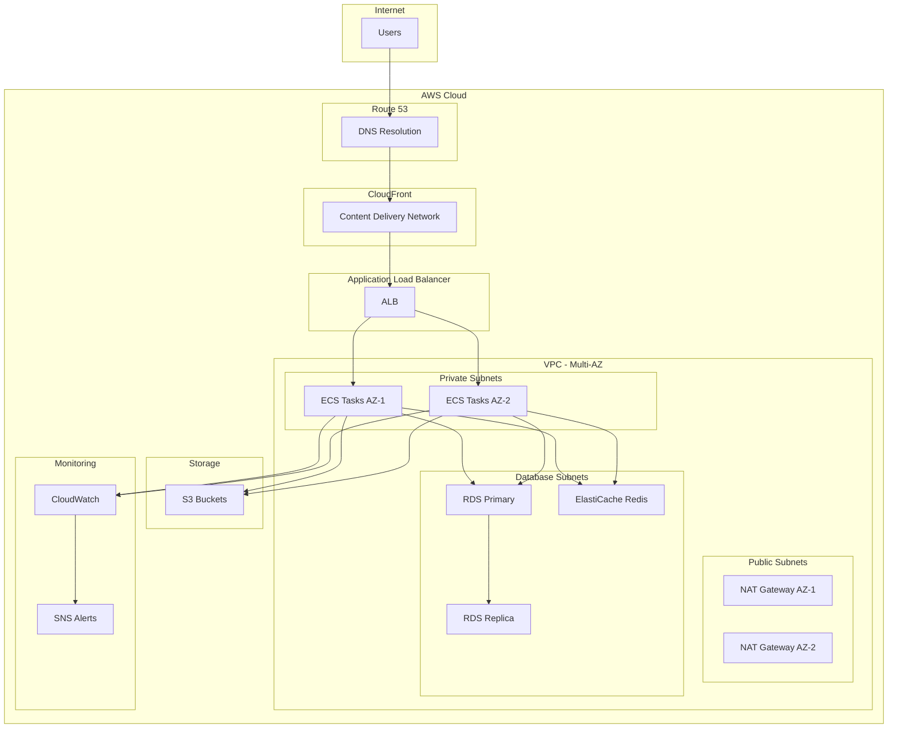

# Cloud Infrastructure Documentation

This document describes the cloud infrastructure setup for the Personal Health Platform using AWS and Terraform.

## Overview

The infrastructure is designed for high availability, scalability, and security using AWS services. It follows best practices for containerized applications with proper monitoring, backup, and disaster recovery capabilities.

## Architecture Diagram



## Infrastructure Components

### 1. Networking (VPC)

**Configuration:**
- **VPC CIDR**: Environment-specific (10.0.0.0/16 for dev, 10.1.0.0/16 for staging, 10.2.0.0/16 for prod)
- **Availability Zones**: 2 for dev/staging, 3 for production
- **Subnets**:
  - Public subnets for load balancers and NAT gateways
  - Private subnets for application containers
  - Database subnets for RDS and ElastiCache

**Security:**
- Internet Gateway for public internet access
- NAT Gateways for outbound internet access from private subnets
- VPC Endpoints for AWS services (S3, ECR, CloudWatch)
- Network ACLs and Security Groups for traffic control

### 2. Container Orchestration (ECS)

**ECS Cluster:**
- Fargate launch type for serverless containers
- Auto Scaling based on CPU, memory, and request count
- Service discovery for inter-service communication

**Services:**
- **Frontend Service**: React application (Nginx)
- **Backend Service**: Node.js API server

**Task Definitions:**
- Multi-container support
- Health checks and graceful shutdowns
- Resource limits and reservations
- Log aggregation to CloudWatch

### 3. Load Balancing (ALB)

**Application Load Balancer:**
- Layer 7 load balancing
- SSL/TLS termination
- Path-based routing (/ for frontend, /api for backend)
- Health checks and automatic failover

**Target Groups:**
- Frontend target group (port 3000)
- Backend target group (port 5000)
- Health check endpoints (/health)

### 4. Database (RDS PostgreSQL)

**Configuration:**
- PostgreSQL 15.4 engine
- Multi-AZ deployment for high availability
- Automated backups with point-in-time recovery
- Read replicas for production workloads

**Security:**
- Encryption at rest and in transit
- Database subnet group in private subnets
- Security groups restricting access to ECS tasks only
- Parameter groups for performance tuning

**Backup Strategy:**
- Automated daily backups
- 7-30 day retention based on environment
- Manual snapshots before major deployments

### 5. Caching (ElastiCache Redis)

**Configuration:**
- Redis 7.x with cluster mode
- Multi-AZ replication for high availability
- Encryption at rest and in transit
- Authentication with auth tokens

**Use Cases:**
- Session storage
- API response caching
- Rate limiting data
- Real-time analytics

### 6. Storage (S3)

**Buckets:**
- **Uploads Bucket**: User-uploaded files (medical documents, images)
- **Static Assets Bucket**: Application static files
- **Backups Bucket**: Database and application backups
- **ALB Logs Bucket**: Load balancer access logs

**Security:**
- Server-side encryption (AES-256)
- Bucket policies and IAM roles
- Versioning enabled
- Public access blocked

**Lifecycle Policies:**
- Transition to IA after 30 days
- Transition to Glacier after 90 days
- Automatic cleanup of incomplete uploads

### 7. Container Registry (ECR)

**Repositories:**
- Frontend container images
- Backend container images
- Vulnerability scanning enabled
- Lifecycle policies for image cleanup

### 8. Monitoring and Logging

**CloudWatch:**
- Application logs from ECS tasks
- Infrastructure metrics
- Custom application metrics
- Log retention policies

**Alarms:**
- High CPU/memory utilization
- Application error rates
- Database performance issues
- Load balancer response times

**Dashboard:**
- Real-time infrastructure metrics
- Application performance indicators
- Cost monitoring

### 9. Security

**IAM Roles and Policies:**
- ECS task execution roles
- ECS task roles for AWS service access
- Least privilege access principles

**Security Groups:**
- ALB security group (ports 80, 443)
- ECS tasks security group (application ports)
- RDS security group (port 5432)
- ElastiCache security group (port 6379)

**Secrets Management:**
- AWS Systems Manager Parameter Store
- Encrypted parameters for sensitive data
- Automatic rotation capabilities

### 10. Auto Scaling

**ECS Service Auto Scaling:**
- Target tracking scaling policies
- CPU and memory utilization targets
- Request count per target scaling
- Scheduled scaling for predictable loads

**Database Scaling:**
- Read replicas for read-heavy workloads
- Vertical scaling for compute resources
- Storage auto-scaling

## Environment Configurations

### Development Environment

```yaml
Resources:
  - VPC: 10.0.0.0/16
  - AZs: 2
  - ECS: t3.micro equivalent (256 CPU, 512 MB)
  - RDS: db.t3.micro
  - ElastiCache: cache.t3.micro
  - Auto Scaling: 1-3 tasks
  - Backups: 1 day retention
```

### Staging Environment

```yaml
Resources:
  - VPC: 10.1.0.0/16
  - AZs: 2
  - ECS: t3.small equivalent (512 CPU, 1024 MB)
  - RDS: db.t3.small
  - ElastiCache: cache.t3.small
  - Auto Scaling: 1-5 tasks
  - Backups: 3 days retention
```

### Production Environment

```yaml
Resources:
  - VPC: 10.2.0.0/16
  - AZs: 3
  - ECS: t3.large equivalent (1024 CPU, 2048 MB)
  - RDS: db.r6g.large with read replica
  - ElastiCache: cache.r6g.large with replication
  - Auto Scaling: 2-20 tasks
  - Backups: 30 days retention
```

## Deployment Process

### 1. Infrastructure Deployment

```bash
# Initialize Terraform
cd infrastructure/terraform
terraform init

# Plan infrastructure changes
./scripts/deploy-infrastructure.sh dev plan

# Apply infrastructure changes
./scripts/deploy-infrastructure.sh dev apply

# Check infrastructure status
./scripts/deploy-infrastructure.sh dev status
```

### 2. Application Deployment

```bash
# Build and push container images
docker build -t health-platform-frontend .
docker tag health-platform-frontend:latest <ecr-url>/health-platform-frontend:latest
docker push <ecr-url>/health-platform-frontend:latest

# Update ECS service
aws ecs update-service --cluster health-platform-dev --service frontend --force-new-deployment
```

### 3. Database Migration

```bash
# Run database migrations
aws ecs run-task --cluster health-platform-dev --task-definition backend --overrides '{
  "containerOverrides": [{
    "name": "backend",
    "command": ["npm", "run", "db:migrate"]
  }]
}'
```

## Cost Optimization

### 1. Resource Right-Sizing

- **ECS Tasks**: Use appropriate CPU and memory allocations
- **RDS Instances**: Monitor utilization and adjust instance types
- **ElastiCache**: Use reserved instances for predictable workloads

### 2. Storage Optimization

- **S3 Lifecycle Policies**: Automatic transition to cheaper storage classes
- **EBS Optimization**: Use gp3 volumes with appropriate IOPS
- **Log Retention**: Set appropriate retention periods

### 3. Reserved Instances

- **RDS Reserved Instances**: 1-3 year commitments for production
- **ElastiCache Reserved Nodes**: Significant savings for steady workloads

### 4. Spot Instances

- **ECS Spot Capacity**: Use Fargate Spot for non-critical workloads
- **Development Environments**: Use spot instances for cost savings

## Security Best Practices

### 1. Network Security

- **VPC Design**: Proper subnet segmentation
- **Security Groups**: Least privilege access
- **NACLs**: Additional layer of network security
- **VPC Flow Logs**: Network traffic monitoring

### 2. Data Protection

- **Encryption**: At rest and in transit for all data
- **Backup Encryption**: Encrypted backups and snapshots
- **Key Management**: AWS KMS for encryption keys
- **Data Classification**: Proper handling of sensitive health data

### 3. Access Control

- **IAM Policies**: Least privilege principles
- **MFA**: Multi-factor authentication for admin access
- **Service Roles**: Dedicated roles for each service
- **Regular Audits**: Access reviews and cleanup

### 4. Compliance

- **HIPAA Compliance**: Health data protection requirements
- **SOC 2**: Security and availability controls
- **Audit Logging**: Comprehensive audit trails
- **Data Residency**: Regional data storage requirements

## Monitoring and Alerting

### 1. Infrastructure Monitoring

```yaml
Metrics:
  - CPU Utilization: >80% for 5 minutes
  - Memory Utilization: >80% for 5 minutes
  - Disk Usage: >85%
  - Network Errors: >1% error rate

Alerts:
  - Email notifications for critical alerts
  - Slack integration for team notifications
  - PagerDuty for on-call escalation
```

### 2. Application Monitoring

```yaml
Metrics:
  - Response Time: >1s average for 5 minutes
  - Error Rate: >5% for 2 minutes
  - Request Volume: Unusual spikes or drops
  - Database Connections: >80% of max connections

Health Checks:
  - Application health endpoints
  - Database connectivity
  - External service dependencies
```

### 3. Security Monitoring

```yaml
Events:
  - Failed login attempts
  - Privilege escalation
  - Unusual API access patterns
  - Data access anomalies

Compliance:
  - Access log analysis
  - Configuration drift detection
  - Vulnerability scanning results
```

## Disaster Recovery

### 1. Backup Strategy

**RDS Backups:**
- Automated daily backups
- Point-in-time recovery
- Cross-region backup replication for production

**Application Backups:**
- ECS task definitions and service configurations
- Application configuration and secrets
- Container images in ECR

**Data Backups:**
- S3 cross-region replication
- Database export to S3
- Configuration backups

### 2. Recovery Procedures

**RTO (Recovery Time Objective):** 4 hours
**RPO (Recovery Point Objective):** 1 hour

**Recovery Steps:**
1. Assess the scope of the disaster
2. Activate disaster recovery team
3. Restore infrastructure from Terraform
4. Restore database from latest backup
5. Deploy application containers
6. Validate system functionality
7. Update DNS to point to recovery environment

### 3. Testing

- **Monthly**: Backup restoration tests
- **Quarterly**: Full disaster recovery drills
- **Annually**: Cross-region failover tests

## Maintenance

### 1. Regular Tasks

**Weekly:**
- Security patch reviews
- Performance metric analysis
- Cost optimization review

**Monthly:**
- Infrastructure capacity planning
- Security audit and compliance check
- Backup and recovery testing

**Quarterly:**
- Architecture review and optimization
- Disaster recovery testing
- Cost analysis and optimization

### 2. Updates and Upgrades

**Operating System:**
- Fargate platform version updates
- Base container image updates

**Database:**
- PostgreSQL minor version updates
- Parameter tuning and optimization

**Application:**
- Dependency updates and security patches
- Performance optimization

## Troubleshooting

### Common Issues

1. **ECS Task Failures**
   ```bash
   # Check task logs
   aws logs get-log-events --log-group-name /aws/ecs/health-platform/backend
   
   # Check task definition
   aws ecs describe-task-definition --task-definition health-platform-backend
   ```

2. **Database Connection Issues**
   ```bash
   # Check RDS status
   aws rds describe-db-instances --db-instance-identifier health-platform-database
   
   # Check security groups
   aws ec2 describe-security-groups --group-ids sg-12345678
   ```

3. **Load Balancer Issues**
   ```bash
   # Check target health
   aws elbv2 describe-target-health --target-group-arn arn:aws:elasticloadbalancing:...
   
   # Check ALB logs
   aws s3 ls s3://health-platform-alb-logs/
   ```

### Performance Issues

1. **High CPU Usage**
   - Scale up ECS tasks
   - Optimize application code
   - Add caching layers

2. **Database Performance**
   - Analyze slow queries
   - Add database indexes
   - Scale up RDS instance

3. **Memory Issues**
   - Increase task memory allocation
   - Optimize memory usage in application
   - Add memory-based alerts

## Support and Documentation

### Getting Help

1. **AWS Support**: Enterprise support plan for production
2. **Documentation**: Comprehensive runbooks and procedures
3. **Team Knowledge**: Cross-training and documentation
4. **Vendor Support**: Third-party service support contacts

### Additional Resources

- [AWS Well-Architected Framework](https://aws.amazon.com/architecture/well-architected/)
- [ECS Best Practices](https://docs.aws.amazon.com/AmazonECS/latest/bestpracticesguide/)
- [RDS Best Practices](https://docs.aws.amazon.com/AmazonRDS/latest/UserGuide/CHAP_BestPractices.html)
- [Terraform AWS Provider](https://registry.terraform.io/providers/hashicorp/aws/latest/docs)